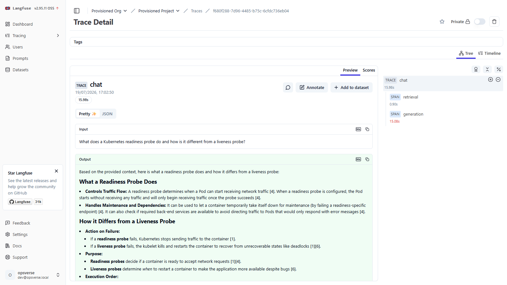

# OpsVerse AI

A production-grade **LLM engineering platform** for the DevOps / MLOps / LLMOps
domain, built end-to-end to demonstrate the full lifecycle of a modern AI system:

> data engineering → hybrid RAG → **evaluation-first** → fine-tuning (OpsLM) →
> gateway → security → MCP → observability

Everything here runs on **free tiers and local compute** (Docker Compose, Gemini
free tier, Colab T4 for training) — the constraint is deliberate, and the
routing/caching/quota-aware design is a direct consequence of it.

> **Design ethos:** every non-trivial choice has an [ADR](docs/adr/); every quality
> claim has a **measured number** and an honest caveat; the evaluation harness was
> built **before** the fine-tune so "better than base" is provable, not asserted.

---

## What works today (measured)

| Capability | Evidence |
|---|---|
| **Hybrid RAG** (BGE dense + BM25 sparse, RRF fusion, citations, SSE streaming) | 1,241 docs / 7,383 chunks; hybrid MRR@10 **0.705** ([ablation v2](docs/reports/retrieval-ablation-v2.md)) |
| **Paraphrase-robust retrieval** — proved hybrid > sparse under reworded queries | sparse drops **−0.149** MRR on paraphrases, hybrid only −0.049 ([ablation v3](docs/reports/retrieval-ablation-v3.md)) |
| **RAG answer quality** (LLM-judged, cached) | faithfulness **1.0**, answer-relevance **0.99**, citation-use **1.0** (n=20) |
| **Evaluation platform** — Postgres eval store, pinned regression gate, CI eval gate | 15 thresholds, green on GitHub Actions ([ADR-0005](docs/adr/0005-ci-eval-gate-committed-fixture.md)) |
| **Tool-use / structured-output eval** — deterministic JSON-fidelity gate | base model 1.0 parse/schema/field; the "did SFT break JSON?" check ([ADR-0012](docs/adr/0012-structured-output-tool-use-eval.md)) |
| **Security** — injection quarantine, secret redaction, red-team classifier | TPR **1.0**, specificity **1.0** ([ADR-0007](docs/adr/0007-layered-security-heuristics-over-presidio.md)) |
| **LLM gateway** — Redis response cache + daily budget kill-switch | cache hit **184× faster, $0** vs paid call ([ADR-0008](docs/adr/0008-gateway-as-library-not-proxy.md)) |
| **Observability** — every request traced (retrieval scores → tokens → cost) | Langfuse self-host; live trace verified via API ([ADR-0010](docs/adr/0010-observability-langfuse-v2-facade.md)) |
| **MCP server** — search/chat/evals/costs as tools for Claude Desktop / Cursor | 5 tools, verified live over stdio |
| **Synthetic instruction dataset** — 3 grounded formats, decontaminated, DVC-versioned | 593 pairs; QLoRA training script pinned & resumable |
| **Inference lab** — one OpenAI-compatible harness for Ollama/vLLM/SGLang | measurement math unit-tested ([ADR-0011](docs/adr/0011-inference-lab-openai-compatible-harness.md)); GPU run pending |

**104 tests · ruff + pyright clean · CI + eval-gate green.**

A single `/chat` request as Langfuse sees it — retrieval and generation spans with the latency split:



---

## Architecture

```
                    ┌──────────────────────────────────────────────┐
   MCP clients ───► │            OpsVerse API (FastAPI)            │ ◄─── Next.js UI
 (Claude/Cursor)    │  /ingest /search /chat(SSE/WS) /evals /costs │   (chat · evals · costs)
                    │  security middleware · request ledger        │
                    └───┬───────────────┬───────────────┬──────────┘
                        │               │               │
                 ┌──────▼─────┐  ┌──────▼──────┐  ┌──────▼──────────┐
                 │ Ingestion  │  │ RAG engine  │  │ LLM gateway     │
                 │ parse·chunk│  │ hybrid+RRF  │  │ cache·budget·   │
                 │ quality·   │  │ rerank·cite │  │ fallback·ledger │
                 │ security   │  │ (degrade    │  │ (LiteLLM client)│
                 │ DVC        │  │  ladder)    │  └──────┬──────────┘
                 └──┬─────────┘  └──┬──────────┘         │
        ┌───────────┼───────────────┼───────┐      ┌─────▼─────┐
     ┌──▼──┐ ┌──────▼─┐ ┌───▼────┐ ┌▼──────┐│      │ Gemini    │
     │MinIO│ │Postgres│ │ Qdrant │ │ Redis ││      │ free tier │
     │ raw │ │meta·   │ │ vectors│ │cache· ││      │ (+ OpsLM  │
     │ docs│ │eval·   │ │ +BM25  │ │queue· ││      │  via HF   │
     └─────┘ │ledger  │ └────────┘ │budget ││      │  Phase 5) │
             └────────┘            └───────┘│      └───────────┘
       Offline (Colab T4): instruction-gen → QLoRA (Qwen3-4B → OpsLM) → eval → HF Hub
```

Full write-up: [docs/architecture.md](docs/architecture.md).

---

## Quickstart

```bash
# 1. Infra stack (Postgres, Redis, Qdrant, MinIO)
docker compose -f infra/compose/docker-compose.yml up -d --wait

# 2. Python env (uv manages Python 3.12) + DB migrations
uv sync --all-packages
(cd apps/api && uv run alembic upgrade head)

# 3. API + background worker
uv run uvicorn opsverse_api.main:app --port 8100
uv run arq opsverse_api.worker.WorkerSettings

# 4. Health, ingest, ask
curl http://localhost:8100/health/ready
curl -X POST http://localhost:8100/v1/ingest -H "Content-Type: application/json" \
  -d '{"source_type":"github_repo","uri":"docker/awesome-compose","tool":"docker"}'
curl -X POST http://localhost:8100/v1/chat -H "Content-Type: application/json" \
  -d '{"query":"How does a Kubernetes HPA scale on custom metrics?","stream":false}'
```

Web UI: `cd apps/web && npm run dev` → http://localhost:3000
(chat with citations · eval dashboard · cost/latency panel).

MCP server (Claude Desktop / Cursor): `uv run opsverse-mcp` — config in
[apps/mcp-server](apps/mcp-server/). Requires the API running.

Config is `.env` (copy `.env.example`); every variable is `OPSVERSE_`-prefixed.

---

## Repository layout

```
apps/api          FastAPI: routers (health/ingest/search/chat/costs/evals), worker, db, alembic
apps/web          Next.js UI (chat · evals · costs)
apps/mcp-server   MCP stdio server (search/chat/evals/costs as tools)
libs/core         settings, thin LiteLLM client, LLM gateway (cache/budget), object store
libs/ingestion    parsing, source-aware chunking, quality gates (dedup, language, security)
libs/rag          hybrid retrieval, RRF, rerank, citation-grounded chat + degradation ladder
libs/evals        IR metrics, ablation, LLM-judge (cached), regression gate, CI smoke, contamination guard
libs/security     injection heuristic, secret redaction, red-team evaluator
libs/training     synthetic instruction dataset pipeline (generate · quality · decontaminate)
training/         QLoRA run (Qwen3-4B → OpsLM): scripts, Colab notebook, headless Kaggle kernel, SFT prep
evalsets/         frozen eval sets (retrieval v1/v2/v3, CI fixture, security red-team) + thresholds
docs/adr          12 architecture decision records
docs/reports      6 live reports: retrieval ablations, RAG-quality, security, structured-output
benchmarks/       inference lab: engine-agnostic harness (Ollama/vLLM/SGLang) + methodology
infra/compose     local dev stack (+ `full` profile: Langfuse)   ·   infra/k8s   documented manifests
```

## Development

```bash
uv run pytest -q            # 104 tests
uv run ruff check .         # lint
uv run pyright              # types
uv run python -m opsverse_evals.regression   # eval regression gate
```

## Key decisions (ADRs)

[0001](docs/adr/0001-monorepo-with-uv-workspaces.md) monorepo ·
[0002](docs/adr/0002-qdrant-over-pgvector-and-pinecone.md) Qdrant ·
[0003](docs/adr/0003-fastembed-bge-base-hybrid.md) fastembed/BGE ·
[0004](docs/adr/0004-chat-serving-thin-litellm-sse.md) chat serving ·
[0005](docs/adr/0005-ci-eval-gate-committed-fixture.md) CI eval gate ·
[0006](docs/adr/0006-prompt-variant-testing-without-promptfoo.md) prompt testing ·
[0007](docs/adr/0007-layered-security-heuristics-over-presidio.md) security ·
[0008](docs/adr/0008-gateway-as-library-not-proxy.md) gateway ·
[0009](docs/adr/0009-qwen3-4b-qlora-for-opslm.md) OpsLM fine-tune ·
[0010](docs/adr/0010-observability-langfuse-v2-facade.md) observability ·
[0011](docs/adr/0011-inference-lab-openai-compatible-harness.md) inference lab ·
[0012](docs/adr/0012-structured-output-tool-use-eval.md) tool-use eval

## Writing

- [We built the eval harness before the model — and the numbers changed our retrieval design twice](docs/blog/01-eval-first-changed-my-retrieval-twice.md)
- [The document is the attack surface — RAG security at ingest, measured like a classifier](docs/blog/02-the-document-is-the-attack-surface.md)
