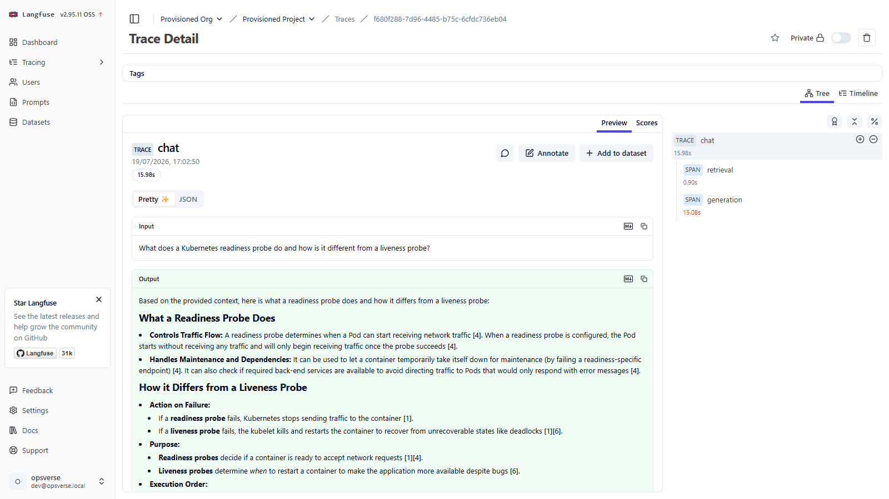

# OpsVerse AI

An **LLM inference & operations platform** — the path a fine-tuned model takes from
artifact to production: **served → optimized → measured → observed → deployed.**

The model is **OpsLM** (Qwen3-4B fine-tuned for DevOps/MLOps); the workload it serves
is citation-grounded RAG over an operations corpus. But the centre of gravity is the
**inference layer** — vLLM serving, quantization, continuous batching, prefix caching,
guided decoding — **measured on a real GPU, not asserted.**

> **Honesty bar (the project's defining constraint):** every number is measured, with
> hardware and *n* stated; raw JSON is committed next to every report so charts are
> reproducible; approximations are labelled at the point of use; and what a single free
> T4 *cannot* show (tensor parallelism, multi-node) is stated as a limitation, never
> faked. Every non-trivial decision has an [ADR](docs/adr/).

### ⭐ Start here — [**the seven things this project was wrong about**](docs/evidence.md)

The stack (hybrid RAG, a QLoRA fine-tune, a served model) is not unusual. This is:
**seven claims believed, measured, and withdrawn** — four of them the project's own
prior conclusions, two of them shipped defaults, and one the LLM judge that produced the
labels for everything else. Each published with the statistic that overturned it.

[`docs/evidence.md`](docs/evidence.md) is the six-minute reading path — claim → report →
raw JSON → the *n* behind it — and it ends with **what this project does not claim**.
Both it and the standalone visual page [`docs/overturns.html`](docs/overturns.html) are
generated from the committed `*-summary.json` files by
`uv run python -m opsverse_evals.overturns`, so the summary cannot drift from its sources.

Built entirely on **free tiers and local compute** (Docker Compose, Colab T4). That
constraint drives the architecture: **ephemeral-GPU measurement + always-on CPU
serving** ([ADR-0016](docs/adr/0016-split-serving-ephemeral-gpu-vs-always-on-cpu.md)),
quota-aware routing, and a cache/budget kill-switch.

---

## The inference layer (measured on a Tesla T4)

One engine-agnostic harness drives an OpenAI-compatible endpoint, so the same
measurement path benchmarks every engine and quantization — the difference is the
engine, not the harness. Full report: **[inference-benchmark-v1](docs/reports/inference-benchmark-v1.md)** ·
visual dashboard: **[benchmarks/dashboard.html](benchmarks/dashboard.html)** (self-contained,
open in any browser) · raw JSON in [`benchmarks/results/`](benchmarks/results/).

| Under a 1→16 concurrency sweep | **vLLM · FP16** | **Ollama · GGUF Q4** |
|---|---|---|
| Throughput scaling | **13.4×** | 0.89× |
| p95 latency inflation | **0.81×** (improved) | 16.0× |
| Prefix cache (on vs off *control*) | **47.8%** vs 0.0% | 35.1% |
| Guided decoding (JSON parse, off→on) | **0 → 1.00** | 0 → 0.00 (unsupported) |
| Single-stream latency (c=1) | 13.0s | **3.6s** |

**The finding:** same model, same T4, same harness — vLLM's continuous batching scales
throughput 13× while *lowering* tail latency; Ollama, without it, serializes concurrent
requests so throughput stays flat and latency inflates 16×. Ollama wins single-stream
(Q4 is lighter than FP16) but collapses under load. This is the clearest measured
demonstration of *why* a dedicated serving engine matters — and the prefix-cache
**control** (47.8% on vs 0.0% off) isolates the cache from warm-up rather than assuming it.

### What it costs, and where it runs out — [capacity & SLO analysis](docs/reports/capacity-and-slo-v1.md)

Throughput is not capacity. Holding both engines to the same latency contract
(**p95 TTFT ≤ 1s, p95 end-to-end ≤ 30s**) converts the benchmark into a deployment answer:

| Under the SLO | **vLLM · FP16** | **Ollama · GGUF Q4** |
|---|---|---|
| Max serviceable concurrency | **c=16** (all levels pass) | **c=1** (c=4 and c=16 both violate) |
| Goodput — throughput that meets the SLO | **233 tok/s** | 37 tok/s |
| Cost per 1M tokens *(assumes $0.35/hr T4)* | **$0.42** | $2.61 |

**6.3× the goodput at 1/6th the cost per token** — a smaller, more defensible number than
the 13.4× headline, because it is the advantage that survives a user-facing latency budget.

Two things the same analysis reports against itself: vLLM was **not saturated** at c=16
(65% marginal efficiency — peak throughput is *un-measured*, the sweep ended before the
device did), and two independent vLLM runs at c=1 differed by **±22%**, which is the noise
floor any single-run delta has to clear. Every headline number is printed with its `n`.

- **Model registry** — versions, quant, deploy status, joined to the benchmark numbers
  automatically: [docs/model-registry.md](docs/model-registry.md)
- **Optimization techniques** — speculative decoding (lossless-verified), guided decoding
  (token-masking FSM), quantization Pareto frontier — implemented + unit-tested
  ([ADR-0014](docs/adr/0014-inference-optimization-techniques.md))
- **Honest gaps:** the quantization→quality frontier needs a served-model eval pass
  (pending); a single T4 can't demonstrate tensor parallelism (explained, not faked).

---

## Evaluation-first (the discipline)

The eval harness was built **before** the fine-tune, so "better than base" is provable,
not asserted — and it has already changed the design:

| Capability | Evidence |
|---|---|
| **Golden set** — pooled (TREC-style), **graded 0-3**, position-randomised, **1,914 judgements** | 100 queries, mean **19.1 candidates/query** pooled across all 4 modes, **70/100 multi-label**; judge sanity-checked at **100% seed recovery** ([report](docs/reports/retrieval-golden-v1.md), [ADR-0019](docs/adr/0019-golden-set-pooled-graded-relevance.md)) |
| **Judge validation** — the golden set's own labels audited against a blinded second rater, then a human | the judge **misses about half the relevant material** — TPR **0.556** vs a human rater, **0.472** vs a model, on the same 40 tasks. A second *model* first put the calibration offset at +0.327; the **human labels reproduced the direction but not the magnitude** (+0.226, spanning zero), and the model rater proved the more lenient of the two (−0.279, excluding zero). Direction measured, magnitude open; the per-mode bias is equal so the **comparisons stand** ([v1](docs/reports/judge-validation-v1.md), [v2](docs/reports/judge-validation-v2.md), [ADR-0022](docs/adr/0022-judge-validation-against-a-second-rater.md)) |
| **Significance testing** — bootstrap CIs + **paired permutation tests**, not bare means | every gap vs `hybrid` tested at 10k permutations; **`hit@10` is saturated** (0.97-0.99, no significant difference anywhere) and **sparse vs hybrid is a statistical tie** (nDCG +0.008, p=0.57) — two prior "wins" downgraded |
| **Contextual recall** — independent reference answers (412 atomic claims), scored against retrieved context | dense **significantly worse** than hybrid (p=0.048) — reproduces the retrieval-side finding with a completely different, generator-side measurement ([report](docs/reports/generator-golden-v1.md)) |
| **Chunking ablation** — re-parsed the original source docs under 3 chunk-size configs | shipped default (350 tok) is **not** the best-measured option: smaller chunks (150 tok) score significantly better on `nDCG_graded@10` (+0.044, p=0.0002) ([report](docs/reports/chunking-ablation-v1.md), [ADR-0020](docs/adr/0020-chunking-and-multiturn-ablations.md)) |
| **Embedding-model ablation** — cost vs quality across an 18× size ladder (384→1024-dim) | **no significant difference** between the incumbent and a model **3.1× smaller** (p=0.94 nDCG, p=0.93 recall) — the incumbent's extra size isn't earning its cost on this corpus ([report](docs/reports/embedding-ablation-v1.md), [ADR-0021](docs/adr/0021-embedding-model-ablation.md)) |
| **Multi-turn eval** — the first conversational eval set; tests the cheapest fix for a real gap | retrieval ignores conversation history in production; the naive fix (concatenation) **doesn't help** — trends worse, not significant (p=0.25-0.45) ([report](docs/reports/multiturn-v1.md)) |
| **Metric-independence audit** — implemented `precision@k` / `recall@k` / contextual-precision, then **declined to report three of them** | on a single-gold-label set `recall@k ≡ hit@k`, `precision@k ≡ hit@k/k`, ctx-precision ≡ `MRR` — verified to **1e-12 across 300 cases × 4 modes** ([audit](docs/reports/retrieval-metrics-audit-v1.md), [ADR-0018](docs/adr/0018-retrieval-metrics-independence-audit.md)) |
| **Paraphrase-robust retrieval** — the eval *falsified the project's own v2 result* | a sparse "win" on the raw set collapsed **−0.149** MRR under reworded queries; hybrid held (−0.049) ([ablation v3](docs/reports/retrieval-ablation-v3.md)). **Chapter three:** under pooled graded labels the two are a *statistical tie* ([ADR-0019](docs/adr/0019-golden-set-pooled-graded-relevance.md)) |
| **Hybrid RAG** (BGE dense + BM25 sparse, RRF, citations, SSE) | 1,241 docs / 7,383 chunks; hybrid MRR@10 **0.705** ([ablation v2](docs/reports/retrieval-ablation-v2.md)) |
| **RAG answer quality** (LLM-judged, cached) | faithfulness **1.0**, answer-relevance **0.99**, citation-use **1.0** (n=20) |
| **Regression gate in CI** — Postgres eval store, pinned thresholds | 15 thresholds, green on GitHub Actions ([ADR-0005](docs/adr/0005-ci-eval-gate-committed-fixture.md)) |
| **Structured-output eval** — deterministic JSON-fidelity gate | 1.0 parse/schema/field — the "did SFT break tool-use?" check ([ADR-0012](docs/adr/0012-structured-output-tool-use-eval.md)) |

---

## The rest of the platform (the workload it serves)

| Capability | Evidence |
|---|---|
| **OpsLM fine-tune** — Qwen3-4B → OpsLM, QLoRA on Colab T4, published to HF | [dhf1234/OpsLM-v1](https://huggingface.co/dhf1234/OpsLM-v1): merged 16-bit + LoRA + GGUF Q4_K_M ([ADR-0009](docs/adr/0009-qwen3-4b-qlora-for-opslm.md)) |
| **LLM gateway** — Redis response cache + daily budget kill-switch | cache hit **25–137 ms at $0** (mean 53.8 ms, n=13) vs a 5–21 s cold call, measured 2026-07-26 ([ADR-0008](docs/adr/0008-gateway-as-library-not-proxy.md)) |
| **Security** — injection quarantine, secret redaction, red-team classifier | TPR **1.0**, specificity **1.0** ([ADR-0007](docs/adr/0007-layered-security-heuristics-over-presidio.md)) |
| **Observability** — every request traced (retrieval scores → tokens → cost) | Langfuse self-host; live trace verified ([ADR-0010](docs/adr/0010-observability-langfuse-v2-facade.md)) |
| **MCP server** — search/chat/evals/costs as tools for Claude Desktop / Cursor | 5 tools, verified live over stdio |
| **Synthetic instruction dataset** — 3 grounded formats, decontaminated, DVC-versioned | 838 generated examples; OpsLM-v1 trained on the committed **593-pair split** (534 train / 59 val) — [provenance](docs/adr/0009-qwen3-4b-qlora-for-opslm.md) |
| **DPO alignment** — prefer grounded/hedged answers over confident hallucinations | pipeline + TRL DPOTrainer, tested ([ADR-0015](docs/adr/0015-dpo-preference-alignment.md)); v2 run pending |
| **Demo site** — terminal-aesthetic Next.js, OpenAI-compatible chat | [ops-verse.vercel.app](https://ops-verse.vercel.app) — serves the live [benchmark dashboard](https://ops-verse.vercel.app/dashboard.html); chat runs in **labelled demo mode** (canned answers); no model endpoint is wired yet. Always-on path = Oracle ARM + Ollama, scaffolded in `infra/oracle-opslm/`, not yet provisioned |

**245 tests · ruff + pyright clean · CI + eval-gate green · 22 ADRs.**

A single `/chat` request as Langfuse sees it — retrieval and generation spans with the latency split:



---

## Architecture

```
                    ┌──────────────────────────────────────────────┐
   MCP clients ───► │            OpsVerse API (FastAPI)            │ ◄─── Next.js UI
 (Claude/Cursor)    │  /ingest /search /chat(SSE/WS) /evals /costs │   (chat · evals · costs)
                    │  security middleware · request ledger        │
                    └───┬───────────────┬───────────────┬──────────┘
                        │               │               │
                 ┌──────▼─────┐  ┌──────▼──────┐  ┌──────▼──────────┐
                 │ Ingestion  │  │ RAG engine  │  │ LLM gateway     │
                 │ parse·chunk│  │ hybrid+RRF  │  │ cache·budget·   │
                 │ quality·   │  │ rerank·cite │  │ fallback·ledger │
                 │ security   │  │ (degrade)   │  │ (OpenAI-shaped) │
                 └──┬─────────┘  └──┬──────────┘  └──────┬──────────┘
                    │               │                    │ OpenAI-compatible surface
        ┌───────────┼───────────────┼───────┐   ┌────────┴─────────────────────┐
     ┌──▼──┐ ┌──────▼─┐ ┌───▼────┐ ┌▼──────┐│   │ vLLM (Colab T4, ephemeral)   │
     │MinIO│ │Postgres│ │ Qdrant │ │ Redis ││   │  paged-attn · cont. batching │
     │ raw │ │meta·   │ │ vectors│ │cache· ││   │  prefix cache · guided decode│
     │ docs│ │eval·   │ │ +BM25  │ │queue· ││   ├──────────────────────────────┤
     └─────┘ │ledger  │ └────────┘ │budget ││   │ Ollama (Oracle ARM, always-on)│
             └────────┘            └───────┘│   │  GGUF Q4 · the public demo    │
                                            │   └──────────────┬───────────────┘
                                            │        OpsLM-v1 (Qwen3-4B QLoRA)
       Offline (Colab T4): instruction-gen → QLoRA → eval → HF Hub → serve → benchmark
```

Full write-up: [docs/architecture.md](docs/architecture.md) · **inference technical design:**
[docs/inference-design.md](docs/inference-design.md) (flow · scaling · failure handling ·
tradeoffs) · repositioning rationale: [docs/migration-plan.md](docs/migration-plan.md).

---

## Quickstart

```bash
# 1. Infra stack (Postgres, Redis, Qdrant, MinIO)
docker compose -f infra/compose/docker-compose.yml up -d --wait

# 2. Python env (uv manages Python 3.12) + DB migrations
uv sync --all-packages
(cd apps/api && uv run alembic upgrade head)

# 3. API + background worker
uv run uvicorn opsverse_api.main:app --port 8100
uv run arq opsverse_api.worker.WorkerSettings

# 4. Health, ingest, ask
curl http://localhost:8100/health/ready
curl -X POST http://localhost:8100/v1/chat -H "Content-Type: application/json" \
  -d '{"query":"How does a Kubernetes HPA scale on custom metrics?","stream":false}'
```

Web UI: `cd apps/web && npm run dev` → http://localhost:3000 ·
MCP server: `uv run opsverse-mcp` (config in [apps/mcp-server](apps/mcp-server/)) ·
Config is `.env` (copy `.env.example`), every variable `OPSVERSE_`-prefixed.

**Reproduce the inference benchmarks** (needs a CUDA GPU): open
[`benchmarks/notebooks/opslm_inference_bench_colab.ipynb`](benchmarks/notebooks/opslm_inference_bench_colab.ipynb)
on a Colab T4, run top to bottom, then `python benchmarks/report.py --out docs/reports/inference-benchmark-v1.md`.

---

## Repository layout

```
apps/api          FastAPI: routers (health/ingest/search/chat/costs/evals), arq worker, db, alembic
apps/web          Next.js UI (chat · evals · costs)
apps/mcp-server   MCP stdio server (search/chat/evals/costs as tools)
libs/core         settings, OpenAI-shaped LLM client, gateway (cache/budget), Redis-Streams ingest
libs/ingestion    parsing, source-aware chunking, quality gates (dedup, language, security)
libs/rag          hybrid retrieval, RRF, rerank, citation-grounded chat + degradation ladder
libs/evals        IR metrics, ablation, LLM-judge (cached), regression gate, CI smoke, contamination guard
libs/security     injection heuristic, secret redaction, red-team evaluator
libs/training     synthetic instruction dataset + DPO preference pipeline
benchmarks/       inference lab: harness · run_suite (sweep + probes) · report generator · results/ · techniques/
registry/         model registry: models.json source of truth + generator that joins in measured numbers
training/         QLoRA + DPO runs (Qwen3-4B → OpsLM): scripts, Colab notebooks, SFT prep
evalsets/         frozen eval sets (retrieval v1/v2/v3, CI fixture, security red-team) + thresholds
docs/adr          17 architecture decision records          docs/reports  ablations · inference benchmark · capacity/SLO
docs/blog         3 posts        opslm-demo  Vercel demo site        infra/  compose · k8s · oracle-opslm
```

## Development

```bash
uv run pytest -q            # 245 tests
uv run ruff check . && uv run ruff format --check .
uv run pyright
uv run python -m opsverse_evals.regression        # eval regression gate (15 thresholds)
python benchmarks/report.py --out docs/reports/inference-benchmark-v1.md   # regen from results/
python benchmarks/capacity.py --out docs/reports/capacity-and-slo-v1.md    # goodput/cost/saturation
python registry/registry.py --out docs/model-registry.md                   # regen registry
uv run python -m opsverse_evals.overturns                                  # regen evidence.md + overturns.html
```

## Key decisions (ADRs)

[0001](docs/adr/0001-monorepo-with-uv-workspaces.md) monorepo ·
[0002](docs/adr/0002-qdrant-over-pgvector-and-pinecone.md) Qdrant ·
[0003](docs/adr/0003-fastembed-bge-base-hybrid.md) fastembed/BGE ·
[0004](docs/adr/0004-chat-serving-thin-litellm-sse.md) chat serving ·
[0005](docs/adr/0005-ci-eval-gate-committed-fixture.md) CI eval gate ·
[0006](docs/adr/0006-prompt-variant-testing-without-promptfoo.md) prompt testing ·
[0007](docs/adr/0007-layered-security-heuristics-over-presidio.md) security ·
[0008](docs/adr/0008-gateway-as-library-not-proxy.md) gateway ·
[0009](docs/adr/0009-qwen3-4b-qlora-for-opslm.md) OpsLM fine-tune ·
[0010](docs/adr/0010-observability-langfuse-v2-facade.md) observability ·
[0011](docs/adr/0011-inference-lab-openai-compatible-harness.md) inference lab ·
[0012](docs/adr/0012-structured-output-tool-use-eval.md) tool-use eval ·
[0013](docs/adr/0013-streaming-ingestion-redis-streams.md) streaming ingestion ·
[0014](docs/adr/0014-inference-optimization-techniques.md) inference optimization ·
[0015](docs/adr/0015-dpo-preference-alignment.md) DPO alignment ·
[0016](docs/adr/0016-split-serving-ephemeral-gpu-vs-always-on-cpu.md) split serving ·
[0017](docs/adr/0017-slo-constrained-goodput-as-the-capacity-metric.md) goodput as capacity ·
[0022](docs/adr/0022-judge-validation-against-a-second-rater.md) judge validation

## Writing

- [We built the eval harness before the model — and the numbers changed our retrieval design twice](docs/blog/01-eval-first-changed-my-retrieval-twice.md)
- [The document is the attack surface — RAG security at ingest, measured like a classifier](docs/blog/02-the-document-is-the-attack-surface.md)
- ["Which engine is faster?" is the wrong question — measuring continuous batching on a free T4](docs/blog/03-measuring-continuous-batching-on-a-free-t4.md)
